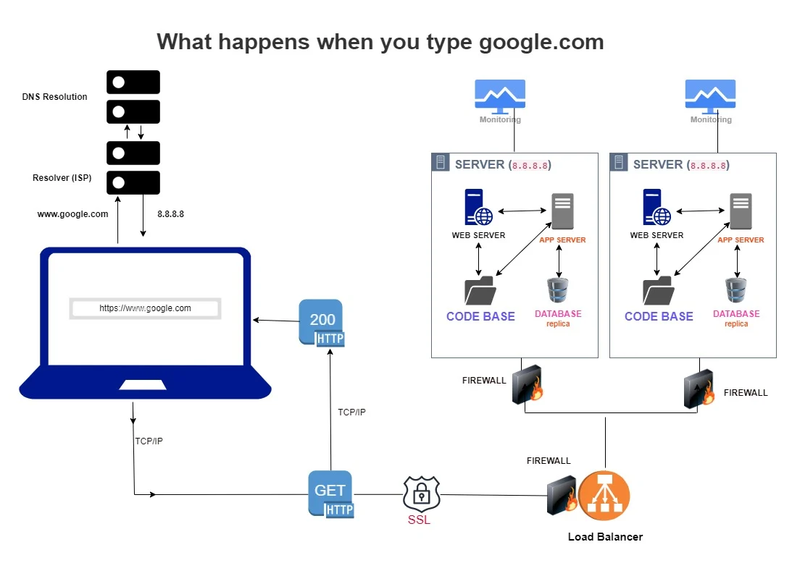

# WHAT HAPPENS WHEN YOU TYPE GOOGLE AND YOU PRESS ENTER?

When you type a URL like "<https://www.google.com>" into a web browser and hit your enter key, there are a lot of things that go on before you finally get some output on your browser.

Fortunately, all these things happen in a split second, so you hardly ever stop to think about them. Before I take the individual steps involved and explain them in detail, let me give you a general overview of everything that goes on within those few microseconds.

1. Your computer sends a request to the `domain name system (DNS)` server which serves as an address book for all domain names. This then sends back the exact IP address of the server which <https://www.google.com> points to.
1. Knowing this IP, your computer then establishes a connection with the server through the IP address. The type of this connection is known as Transmission Control Protocol (TCP) and your computer is able to establish this connection through the Internet Protocol (IP). This whole process is known as a "handshake".
1. If your computer is behind a firewall, the firewall checks to ensure that the particular request you are making is allowed before permitting it. Also, if the server you are trying to access is also behind a firewall, a similar check will be done before you are finally able to connect to the server.
1. After establishing the connection, your browser now sends a request for the webpage using an encryption protocol like Secure Sockets Layer (SSL) or Transport Layer Security (TLS) in order to encrypt the data that will be shared between your computer and the server. This type of encryption is what is responsible for the "s" in **"https"** which also implies that the connection is secure.
1. Companies like Google with high traffic maintain a host of servers and for that matter they have a load balancer that receives most of the requests and sends it to a particular server. The request from your browser will therefore hit the load balancer first which will forward it to a specific server depending on the algorithm used by the load balancer.
1. The server that receives the request then sends a response back to the load balancer which also forwards the response back to your browser. This response will mostly include HTML, CSS, and JavaScript files that makes up Google's homepage.
1. The HTML files returned tells the browser how to render the content of the page. The CSS file tells the browser how to style the content while the JavaScript file adds interactivity to the page.
1. If there is a need for some dynamic content such as Google search results, then the web server will make a request to the application server, which in turn may make a request to a database server to get some data and send it back to the web server. The web server will then include these in the response that it sends back to the browser.
1. Finally, the browser will render the page and display it to you.

---

---

## DNS Request

Anytime you use your browser to access any website or domain name, the browser stores information concerning that domain name (DNS record) in its cache.

So, anytime you type a domain name like "[google.com](https://www.google.com)" into your web browser, the browser first checks its cache to see if it has a recent copy of the DNS record for that domain.

If there is a recent copy of the DNS records for that domain, it will use the IP address in the cache to send a request to the server. This speeds up the process of resolving the domain name to an IP address because it avoids the need to send a request to the DNS server.

If the browser cache does not contain a recent copy of the DNS record, or if the DNS record has changed since the last time it was cached, the browser will send a request to the DNS server to resolve the domain name to an IP address.

### DNS Lookup Process

The browser sends a request to the local DNS resolver, which is often provided by the internet service provider (ISP). The local DNS resolver checks its cache for the most recent copy of the DNS record for the domain. If it has it, it sends the IP address back to the browser. If the local DNS resolver does not have the most recent copy of the DNS record, it sends a request to a root nameserver. The root nameserver replies with the address of a top-level domain (TLD) nameserver, such as `.com`

- The local DNS resolver sends a request to the TLD nameserver.
- The TLD nameserver responds with the address of the authoritative nameserver for the domain.
- The local DNS resolver sends a request to the authoritative nameserver.
- The authoritative nameserver responds with the IP address for the domain.
- The local DNS resolver sends the IP address back to the browser.
- The browser sends a request to the server at the IP address to retrieve the webpage.

This process may involve additional steps if the DNS record is not found at any of the nameservers or if the DNS record is set up to use a service such as DNS load balancing or content delivery networks (CDN).

## TCP/IP Connection

TCP (`Transmission Control Protoco`l) and IP (`Internet Protocol`) are two of the primary protocols that constitute the internet. They work in conjunction to establish a link between a client and a server and facilitate the exchange of data between them. When you input "[google.com](https://www.google.com)" into a web browser, the browser employs TCP/IP to establish a link with the server that hosts the website.

Here is what happens in details:

1. The browser sends a request to the server using IP to establish a connection.
1. The server receives the request and sends back a message acknowledging the request to establish a connection. This is the handshake process.
1. Once the handshake is complete, the browser can send a request for the webpage it wants to access (in this case, the homepage of [google.com](https://www.google.com)). This request is sent using TCP, which ensures that the request is transmitted reliably and in the correct order.
1. The server receives the request and sends back the HTML code for the homepage of [google.com](https://www.google.com) to the browser. This response is also sent using TCP to ensure reliable transmission.
1. The browser receives the HTML code and uses it to render the webpage on your screen. Any resources (such as images) that the webpage needs are also requested and received using TCP/IP.
